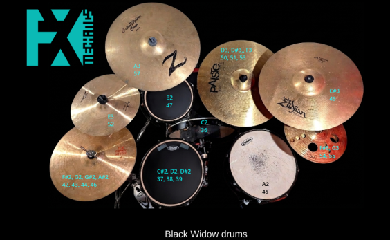
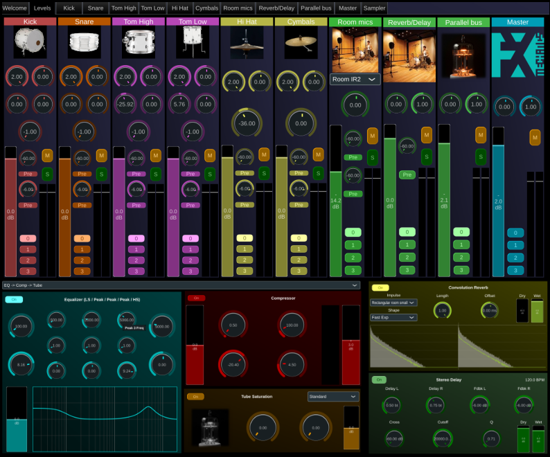

# FxmeSampler

FxmeSampler is a JUCE-based sampling instrument plugin featuring, a flexible multi-channel mixer, built-in convolution reverb, and advanced velocity mapping. All configurations are defined via a portable `mapping.xml` file embedded in the plugin resources.

Licence: LGPL3, see LICENSE file

** Contact: olivier.doare@ensta.fr **

## Overview

The instrument's architecture is defined by a `mapping.xml` file embedded in the plugin's binary resources. This file controls:
*   **Sample Mapping:** Which samples play on which notes/velocities.
*   **Voice Architecture:** Envelopes (ADSR), looping, and playback modes (One-shot).
*   **Routing:** How samples are routed to mixer channels.
*   **Mixer Layout:** Definition of strips, buses, and effect chains.
*   **UI Customization:** Colors, icons, and welcome screen.

> **Effects as standalone plugins:** All the effects used in FxmeSampler (EQ, dynamics, reverb, delay, saturation, etc.) are also available as independent VST3/AU plugins in the [FxmeFX](https://github.com/odoare/FxmeFX) repository.

## Installation

Download the latest release from the [Releases](../../releases) page and follow the instructions for your platform.

### macOS

1. Download `SimpleSampler-macOS.pkg`.
2. Double-click to run the installer — it copies the VST3 to `/Library/Audio/Plug-Ins/VST3/` and the AU to `/Library/Audio/Plug-Ins/Components/`.
3. Because the plugin is not notarized, macOS will block it on first use. Go to **System Settings → Privacy & Security** and click **Allow Anyway**.
4. Restart your DAW. Logic Pro users may need to trigger a rescan in **Logic Pro → Plug-in Manager**.

### Windows

1. Download `SimpleSampler-Windows-Setup.exe`.
2. Right-click and choose **Run as administrator**, then follow the installer steps — it copies the VST3 to `C:\Program Files\Common Files\VST3\`.
3. In Reaper, go to **Options → Preferences → Plug-ins → VST** and click **Re-scan** to detect the new plugin.

### Linux

1. Download `SimpleSampler-VST3-Linux-x86_64.zip` (or `-arm64` for ARM systems).
2. Unzip and copy the `.vst3` bundle to `~/.vst3/`:
   ```bash
   unzip SimpleSampler-VST3-Linux-x86_64.zip
   cp -r VST3/SimpleSampler.vst3 ~/.vst3/
   ```
3. In Reaper, go to **Options → Preferences → Plug-ins → VST** and click **Re-scan**.

## Building

This project uses CMake and requires JUCE 8 as a sibling directory (`../JUCE`) and the [FxmeJuceTools](https://github.com/odoare/FxmeJuceTools) module installed at `../JUCE/usermodules/FxmeJuceTools`.

```bash
cmake -B build -DCMAKE_BUILD_TYPE=Release
cmake --build build --config Release --parallel
```

Artefacts are written to `build/SimpleSampler_artefacts/Release/`.

> **Note:** The embedded demo kit files (wav samples and mapping.xml) currently live under `MyKits/FakeAmbixKit/Data/`, which is gitignored. Move them to a tracked location and update the paths in `CMakeLists.txt` before running CI builds.

## Configuration: `mapping.xml`

The `mapping.xml` file is the core configuration file. Below is the complete specification of its structure and attributes.

### Root Element
The root element must be `<Mappings>`.

```xml
<Mappings>
    <!-- Child elements go here -->
</Mappings>
```

### 1. Welcome Tab
Optional. Defines the content for the "Welcome" tab in the UI.

```xml
<WelcomeTab text="My Instrument" img="logo.png" />
```

| Attribute | Type | Description |
| :--- | :--- | :--- |
| `text` | String | The text displayed on the welcome screen. |
| `img` | String | The filename of the image resource to display. |

### 2. Master Settings
Optional. Configures the master output strip.

```xml
<Master channels="10" img="master_icon.png" color="55,169,181"/>
```

| Attribute | Type | Description |
| :--- | :--- | :--- |
| `channels` | Integer | Total number of internal channels feeding the mixer strips. This must correspond to the sum of channels required by all defined strips (e.g., 4 for Ambisonic, 2 for Stereo). |
| `img` | String | Icon resource for the master strip. |
| `color` | String | Color for the strip (format: "r,g,b" or color name). |

### 3. Mixer Configuration
The `<Mixer>` element contains definitions for channel strips and buses.

#### `<Strip>`
Defines a mixer channel strip.

```xml
<Strip type="ambisonicmono" name="Piano_Top" img="piano.jpg" color="148,153,77" effectChain="dynamics"/>
```

| Attribute | Type | Description |
| :--- | :--- | :--- |
| `type` | String | See Strip Types below. |
| `name` | String | Display name of the strip. |
| `img` | String | Icon resource name. |
| `color` | String | Strip color. |
| `effectChain` | String | Effect chain type. Default is "dynamics". |
| `resource` | String | (For reverb strips) Comma-separated list of Impulse Response (IR) filenames. |

##### Strip Types
| Type | Input Channels | Description |
| :--- | :--- | :--- |
| `mono` | 1 | Single-channel input with standard panning to the stereo mix. |
| `stereo` | 2 | Standard stereo input with balance and M/S-based width control. |
| `ms` | 2 | Mid-Side encoded input, decoded to stereo with width adjustment. |
| `ambisonic` | 4 | First-order Ambisonic (B-Format) input decoded to stereo with Azimuth, Elevation, and Width controls. |
| `ambisonicmono`| 5 | Hybrid strip: 4-ch Ambisonic field + 1-ch Proximity Mono mic. Includes a Mix crossfade between decoded field and mono source. |
| `reverb` | 1 | Mono input processed through a mono convolution reverb engine. |
| `stereoreverb` | 1 | Mono input processed through a stereo convolution reverb engine. |

#### `<Bus>`
Defines an auxiliary bus (always stereo).

```xml
<Bus name="RoomReverb" effectChain="Reverb" resource="room_ir.wav" color="purple"/>
```

| Attribute | Type | Description |
| :--- | :--- | :--- |
| `name` | String | Name of the bus. |
| `effectChain` | String | `Dynamics`, `Reverb`, `Delay`, or `None`. |
| `resource` | String | (For Reverb buses) Comma-separated list of IR filenames. |
| `img` | String | Icon resource name. |
| `color` | String | Bus color. |

**Note:** To prevent feedback loops, a Bus can only send audio to other Buses defined *sequentially after* it in the XML.

### 4. Sample Groups
`<SampleGroup>` elements define shared properties for a set of sounds, such as envelopes and routing.

```xml
<SampleGroup name="Snare" channels="0:6, 1:7" muteGroup="1" midiChannel="10"
             oneShot="false" loop="true" groupLevel="-3.0" minVelocityGain="-20.0"
             attack="0.001" decay="0.2" sustain="0.5" release="0.3" detune="0.0"/>
```

| Attribute | Type | Default | Description |
| :--- | :--- | :--- | :--- |
| `name` | String | Required | Unique identifier for the group. |
| `channels` | String | "0,1" | Output routing. Format: `src:dest` or `dest`. <br>Example: `0:6, 1:7` maps source ch 0 to output 6, source ch 1 to output 7. |
| `muteGroup` | Integer | 0 | Sounds in the same non-zero mute group cut each other off (e.g., Open/Closed Hi-Hat). |
| `midiChannel`| String | "0" | MIDI channel (1-16) or "omni" (0). |
| `oneShot` | Boolean | true | If `true`, plays full sample ignoring note-off. If `false`, enters release phase on note-off. |
| `loop` | Boolean | false | If `true`, loops the sample between `loopStart` and `loopEnd`. |
| `attack` | Float | 0.001 | Attack time in seconds. |
| `decay` | Float | 0.0 | Decay time in seconds. |
| `sustain` | Float | 1.0 | Sustain level (0.0 to 1.0). |
| `release` | Float | 0.1 | Release time in seconds. |
| `detune` | Float | 0.0 | Pitch offset in semitones. |
| `groupLevel` | Float | 0.0 | Static gain offset for the entire group in dB. |
| `minVelocityGain` | Float | -40.0 | The gain in dB applied when MIDI velocity is at its minimum (1). This defines the floor of the velocity-to-gain scaling; 0.0 results in fixed volume regardless of velocity. |

### 5. Sounds
`<Sound>` elements define individual samples.

```xml
<Sound name="Snare_Hit" group="Snare" resource="snare.wav" 
       basePitch="60" noteLow="60" noteHigh="60" velLow="0" velHigh="127"
       sampleStart="0" sampleEnd="-1" loopStart="500" loopEnd="2000"/>
```

| Attribute | Type | Default | Description |
| :--- | :--- | :--- | :--- |
| `name` | String | Required | Name of the sound. |
| `group` | String | - | Name of the parent `<SampleGroup>`. Inherits properties from the group. |
| `resource` | String | Required | Filename of the audio sample in Binary Data. |
| `basePitch` | Integer | 60 | MIDI note number where sample plays at original pitch. |
| `noteLow` | Integer | - | Lowest MIDI note that triggers this sound. |
| `noteHigh` | Integer | - | Highest MIDI note that triggers this sound. |
| `velLow` | Integer | 0 | Lowest velocity. |
| `velHigh` | Integer | 127 | Highest velocity. |
| `sampleStart`| Integer | 0 | Sample index to start playback. |
| `sampleEnd` | Integer | -1 | Sample index to stop playback (-1 = end of file). |
| `loopStart` | Integer | 0 | Sample index for loop start point. |
| `loopEnd` | Integer | -1 | Sample index for loop end point (-1 = sampleEnd). |

## Resource Handling

The plugin loads files from JUCE's `BinaryData`.
1.  **Filenames:** In `mapping.xml`, refer to files by their original filename (e.g., `my sample.wav`).
2.  **Internal Mapping:** The code automatically converts filenames to valid C++ variable names (replacing spaces and dots with underscores) to locate them in `BinaryData`.

# Made with FxmeSampler

## Examplekits folder

In the ExampleKits folder, there are a few small-size projects to show how to use FxmeSampler. For now there are only drum sampler examples, but more will come in the future.

## Black Widow Drums
The **Black Widow Drums** project is the first published drum sampler showcase for FxmeSampler's advanced spatial and processing features. Recorded on a Gretsch Black Widow kit, it utilizes an original microphone array and signal processing chain to deliver a studio-ready drum sound.



### Microphone Configuration
*   **Overheads:** Rode NT-SF1 First-Order Ambisonic microphone, capturing a full 360° sound field.
*   **Kick:** Blue Kick Ball.
*   **Snare/Toms:** Three Shure SM57s (Snare, High Tom, Low Tom).

### Advanced Ambisonic-Mono Routing
Each drum element leverages the **ambisonicmono** hybrid strip. This routes the 4-channel B-Format overhead signal plus the dedicated proximity microphone into a single channel strip. This allows for:
*   **Spatial Sculpting:** Precision control over the elevation, azimuth, and width of the overhead "view" for each specific drum.
*   **The Virtual MS Mic:** The ability to treat the ambisonic field as a virtual Mid-Side pair that can be panned and balanced.
*   **Hybrid Mixing:** An equal-power mix control to blend between the localized spatial field and the punch of the close-mic proximity signal.

### Room Modeling
To optimize performance and reduce the plugin's memory footprint, the room sound is not played back from raw multi-channel files. Instead, a **transfer function** was calculated between the omnidirectional (W) component of the ambisonic overheads and the physical room microphones. 

This resulted in **Impulse Responses (IRs)**. The Room channel in the mixer functions as a real-time convolution engine, applying these IRs to the dry signals. This provides an authentic room character while saving gigabytes of sample data.

### Processing & Mix Architecture
*   **Channel Processing:** Every strip features a dedicated effect chain consisting of a **4-band EQ**, **Dynamics (Compressor/Limiter)**, and **Tube Saturation** for harmonic enhancement.
*   **Parallel Compression Bus:** A dedicated stereo bus for "New York style" parallel compression to add weight and density to the kit.
*   **Spatial FX Bus:** A secondary bus hosting a combined **Delay and Convolution Reverb** for additional depth and atmosphere.


